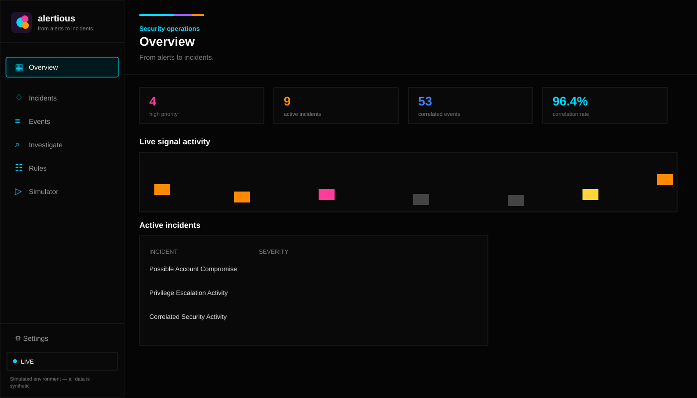
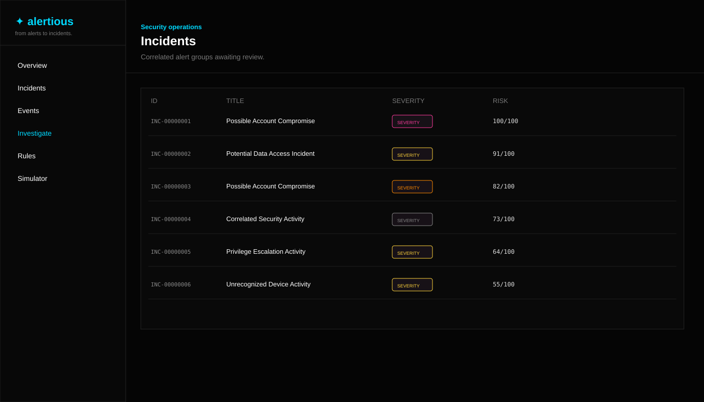
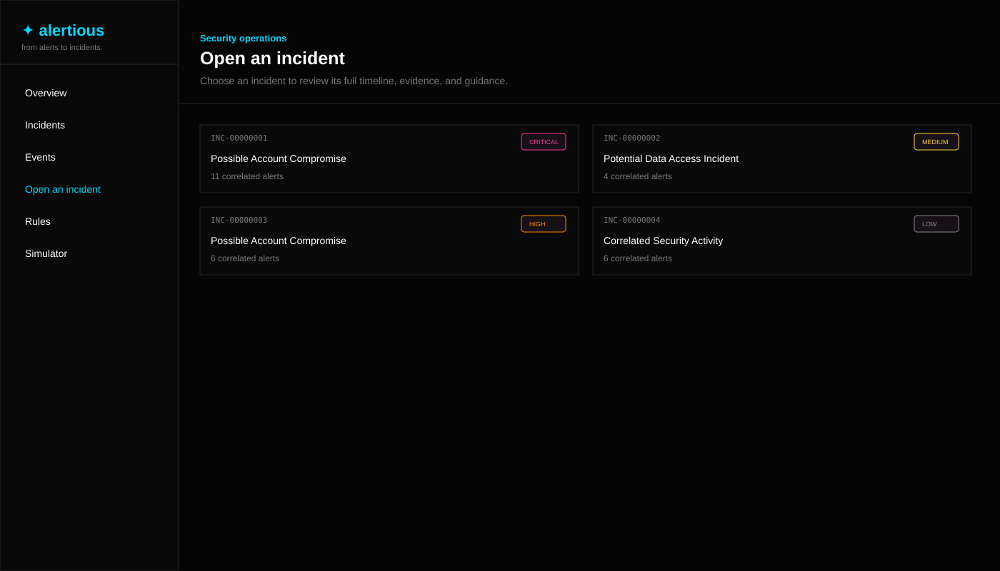
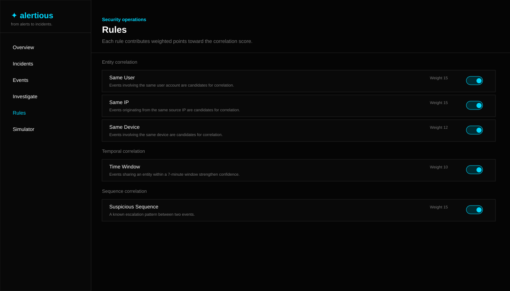

# Alertious

**From alerts to incidents.**

> A deterministic security alert correlation and incident investigation workspace that turns related events into explainable incidents.

[](https://github.com/MumtazFatima-08/Alertious)
[](https://github.com/MumtazFatima-08/Alertious)
[](https://github.com/MumtazFatima-08/Alertious)

Alertious is a portfolio-grade security alert correlation and incident investigation prototype. It demonstrates event normalization, entity- and time-based correlation, deterministic incident reconstruction, explainable risk scoring, and contextual response guidance — all built on transparent, rule-based backend logic rather than a language model.

**Core idea:** individual alerts are often low-signal; the sequence and relationship between them can reveal a security incident. Alertious makes those relationships explicit, auditable, and visible to an analyst.

## 🖥️ Interface Preview

### Overview



### Incidents



### Investigation



### Correlation Rules



---

## Quick navigation

[Problem](#1-problem) · [Architecture](#3-architecture) · [Correlation](#5-correlation-engine) · [Risk Scoring](#7-risk-scoring) · [Simulator](#9-simulator) · [API](#12-api) · [Testing](#13-testing) · [Local Setup](#14-running-it-locally) · [Limitations](#15-limitations)

## 1. Problem

Security tooling generates a large volume of individual alerts. Most, in isolation, are low-signal: a single failed login, a new device, a file open. The security-relevant story usually isn't any one alert — it's the *sequence*:

```
FAILED LOGIN → FAILED LOGIN → SUCCESSFUL LOGIN → NEW DEVICE
  → PRIVILEGE ESCALATION → SENSITIVE FILE ACCESS
```

Individually, none of these alerts justifies analyst attention. Together, they describe a plausible account compromise. Alertious's job is to turn a stream of raw events into that story automatically, explain *why* it drew the connections it did, and tell an analyst what to check next.

## 2. Why Alertious

The project focuses on the correlation and explainability layer rather than treating a dashboard or an LLM response as the detection mechanism. Every correlation decision is backed by named rules, weights, matching entities, and timestamps.

If a reviewer asks **"why did the system decide these events belong together?"**, the investigation view can trace the decision back to concrete evidence instead of an opaque model output.

### What makes the prototype technically interesting

- **Deterministic correlation:** related events are connected using explicit entity, time, and sequence rules.
- **Explainable incidents:** correlation evidence and risk factors are retained and exposed through the API.
- **Real backend pipeline:** simulator events use the same ingestion path as API-generated events.
- **Editable detection logic:** correlation rules and weights are stored in the database and can be changed from the UI.
- **Human-in-the-loop response:** the system provides review guidance but does not perform destructive actions.

## 3. Architecture

```
Event Source (API / Simulator)
        │
        ▼
  Normalization  ── validates event_type/severity, fills defaults,
        │            coerces timestamps to a consistent UTC representation
        ▼
   Persistence   ── SQLite via SQLAlchemy
        │
        ▼
Correlation Engine ── scans a recent time window for events sharing an
        │              entity (user / IP / device / destination) with the
        │              new event, and scores each candidate pair against
        │              enabled correlation rules
        ▼
 Incident Builder ── creates a new incident or attaches to an existing one,
        │             merges entities, records evidence, regenerates title
        ▼
  Risk Scoring    ── additive, explainable 0–100 score with named factors
        │
        ▼
Response Guidance ── deterministic, event-type + context-aware review /
        │             resolution guidance
        ▼
 Investigation UI  ── timeline, evidence, risk factors, guidance, actions
```

Every stage is a plain Python function or class in `backend/app/services/`, independently unit-tested. The frontend never computes or hardcodes any of this — it only renders what the API returns.

## 4. Event schema

The normalized event model is the common contract between ingestion, correlation, incident reconstruction, scoring, and the frontend.

```json
{
  "id": "EVT-a1b2c3d4",
  "timestamp": "2026-01-01T09:00:00",
  "event_type": "LOGIN_FAILED",
  "severity": "LOW",
  "user": "alex",
  "source_ip": "185.23.10.4",
  "device_id": "DEVICE-42",
  "source": "auth-service",
  "destination": null,
  "metadata": {},
  "status": "NEW",
  "incident_id": null
}
```

Supported `event_type` values: `LOGIN_FAILED`, `LOGIN_SUCCESS`, `NEW_DEVICE`, `PRIVILEGE_CHANGE`, `FILE_ACCESS`, `NETWORK_CONNECTION`, `PROCESS_EXECUTION`, `DATA_TRANSFER`, `LOGOUT`.

## 5. Correlation engine

Implemented in `backend/app/services/correlation.py`. For every new event, the engine:

1. Looks back up to 60 minutes for events sharing the same user, source IP, or device.
2. For each candidate, sums the weights of every **enabled** rule whose condition matches between the two events:
   - `same_user`, `same_ip`, `same_device`, `same_destination` — shared entity
   - `time_window` — both events occurred within a 7-minute window (only counted alongside a shared entity, so coincidental timing between unrelated events is never scored)
   - `suspicious_sequence` — the pair matches a known escalation pattern (e.g. `NEW_DEVICE → PRIVILEGE_CHANGE`)
   - `failed_then_success` — a successful login following failed attempts for the same account
   - `high_severity_context` — either event is HIGH/CRITICAL severity
3. If the pairwise score reaches the correlation threshold (30 points), the two events are correlated, and the specific matched rules are recorded as evidence.

All rule weights and enabled/disabled state are stored in the `rules` table and are live-editable from the Rules page — disabling a rule immediately changes correlation behavior for every subsequent event, with no code changes or restart required.

## 6. Incident reconstruction

`backend/app/services/incident_builder.py` decides, for a correlated event, whether to:

- join an existing incident (preferring the most recently updated one if more than one candidate already belongs to an incident), or
- create a new incident from the event and its correlated peers.

The incident's title, involved entities, and severity are recomputed from its actual member events every time it changes — never hand-written. Title selection is a small deterministic rule table (e.g. "privilege change + file access" → *Possible Account Compromise*), not a generative model.

## 7. Risk scoring

`backend/app/services/risk_scoring.py` computes an additive, capped 0–100 score from the incident's member events:

- Points per severity level present (diminishing after 3 of the same severity)
- Fixed points for specific high-signal event types (privilege change, data transfer, sensitive file access, new device, etc.)
- Extra points for repeated authentication failures
- Extra points for a successful login following failures
- Extra points for a multi-stage sequence (3+ distinct event types correlated together)

Every contributing factor is returned as a `{label, points, reason}` object and rendered directly in the Investigation view — nothing is summarized away.

## 8. Response guidance

`backend/app/services/response_guidance.py` is a template-driven, per event-type engine that returns:

- **What happened** — plain-language description of the event
- **Why it matters** — the security rationale, augmented with incident context when the alert is correlated
- **Recommended review** — specific, actionable checks (never "investigate the issue")
- **Possible resolution** — human-reviewed, non-destructive suggestions only

Alertious never recommends or performs automatic destructive actions (disabling accounts, blocking IPs, killing processes, deleting data). All guidance is explicitly framed as something a human analyst reviews and approves.

## 9. Simulator

`backend/app/services/simulator.py` generates six synthetic scenarios (`credential_stuffing`, `account_takeover`, `privilege_escalation`, `insider_activity`, `data_exfiltration`, `normal_activity`). Every event the simulator produces is pushed through the exact same normalize → persist → correlate → build-incident pipeline as any other event — there is no separate "demo mode" logic and no frontend-only animation faking the effect.

### Example investigation flow

A representative account-takeover sequence can look like:

```
FAILED LOGIN
    ↓
FAILED LOGIN
    ↓
SUCCESSFUL LOGIN
    ↓
NEW DEVICE
    ↓
PRIVILEGE CHANGE
    ↓
SENSITIVE FILE ACCESS
    ↓
INCIDENT + EVIDENCE + RISK FACTORS + GUIDANCE
```

The important part is not the synthetic scenario itself; it is that the same backend mechanisms responsible for processing API events produce the resulting incident and evidence.

## 10. Tech stack

- **Frontend:** React, Vite, TypeScript, Tailwind CSS, lucide-react
- **Backend:** Python, FastAPI, Pydantic
- **Database:** SQLite + SQLAlchemy
- **Testing:** pytest (backend), tsc + vite build (frontend)

## 11. Project structure

```
backend/
  app/
    main.py
    api/            events.py, incidents.py, rules.py, simulator.py, stats.py
    models/         event.py, incident.py, rule.py
    schemas/        event.py, incident.py, rule.py
    services/       normalization.py, correlation.py, incident_builder.py,
                     risk_scoring.py, response_guidance.py, simulator.py
    database/       session.py, init_db.py, seed.py
    tests/
frontend/
  src/
    components/     SeverityBadge, StatusBadge, AlertDetailPanel, ...
    pages/          Overview, Incidents, Events, Investigate, Rules, Simulator, Settings
    layouts/        AppLayout (sidebar navigation + live status)
    services/       api.ts (typed fetch client)
    hooks/          useLiveEvents.ts (SSE subscription)
    types/          shared TypeScript types mirroring backend schemas
    utils/          formatting helpers
```

## 12. API

| Method | Path | Description |
|---|---|---|
| GET | `/api/health` | Liveness check |
| GET | `/api/stats` | Operational metrics |
| GET | `/api/events` | Paginated, filterable, sortable event list |
| GET | `/api/events/{id}` | Single event detail |
| GET | `/api/events/{id}/guidance` | Contextual response guidance |
| GET | `/api/events/{id}/evidence` | Correlation evidence |
| POST | `/api/events` | Ingest a new event through the full pipeline |
| PATCH | `/api/events/{id}/status` | Update alert status |
| GET | `/api/incidents` | Filterable incident list |
| GET | `/api/incidents/{id}` | Single incident with full timeline |
| PATCH | `/api/incidents/{id}` | Update incident status |
| GET | `/api/rules` | List correlation rules |
| PATCH | `/api/rules/{id}` | Toggle a rule or change its weight |
| GET | `/api/simulator/scenarios` | List available scenarios |
| POST | `/api/simulator/start` | Run a scenario through the real pipeline |
| GET | `/api/events/stream` | Server-Sent Events stream |

## 13. Testing

37 backend tests cover normalization, correlation rules, risk scoring, response guidance, API behavior, simulator execution, and route-registration regressions.

| Area | Coverage |
|---|---|
| Event normalization | Validation, defaults, timestamp handling |
| Correlation | Entity matching, time window, sequence rules, thresholds |
| Risk scoring | Additive factors, caps, multi-stage sequences |
| Response guidance | Event-type and context-aware guidance |
| API | Event, incident, rule, simulator, and stats routes |
| Simulator | Scenario execution through the real pipeline |
| Frontend | TypeScript compilation and production build |

Run them with:

```bash
cd backend
pip install -r requirements.txt
python -m pytest app/tests -q
```

Frontend type-safety and build:

```bash
cd frontend
npm install
npx tsc -b
npm run build
```

## 14. Running it locally

### Prerequisites

- Python 3.x
- Node.js and npm
- A terminal with separate processes for backend and frontend

### 1. Start the backend

```bash
# backend
cd backend
pip install -r requirements.txt
python -m uvicorn app.main:app --reload --port 8000

# frontend (separate terminal)
cd frontend
npm install
npm run dev
```

The frontend dev server proxies `/api` to `localhost:8000`. On first backend startup the database is created and seeded with a realistic synthetic dataset.

### 2. Open the application

After both processes are running, open the Vite development URL shown in the frontend terminal and use the **Simulator** to generate a scenario. Then inspect the resulting incident from the **Incidents** or **Investigate** views.

### 3. What to verify

A successful local run should let you:

1. Generate a synthetic security scenario.
2. Watch events enter the backend pipeline.
3. See correlated events grouped into an incident.
4. Inspect the correlation evidence and risk factors.
5. Change a correlation rule and observe its effect on subsequent events.

## 15. Limitations

- The correlation engine only considers events sharing an explicit entity (user, IP, device, or destination).
- Simulator scenarios are fixed, hand-designed sequences.
- SQLite and a single-process FastAPI app are appropriate for a local demo, not production ingestion volume.
- There is no authentication/authorization layer; this is a local investigation-workspace prototype.
- Rules use a small fixed vocabulary rather than a learned graph.

## 16. Future improvements

- Learned / graph-based correlation for relationships not captured by explicit entities
- Per-user behavioral baselining
- Background job runner for the simulator
- Multi-incident merge/split tooling
- Role-based access control and audit logging
- Postgres support for realistic ingestion volume
- Authentication, authorization, and analyst audit trails
- Production-oriented ingestion queues and background workers

## 17. Visual design notes

The UI uses a deep-black, multi-accent security-console identity: near-black surfaces, white/off-white typography, cyan for live/system status, electric blue for correlation, violet for analysis, and magenta/orange/yellow for severity. The signal visualizations are based on event data rather than decorative placeholders.

---

## Engineering takeaway

Alertious is intentionally **not** presented as a production SIEM, EDR, or autonomous incident-response platform. Its value as an engineering project is the traceable backend pipeline:

```
Raw Event
   ↓
Normalize
   ↓
Persist
   ↓
Correlate
   ↓
Reconstruct Incident
   ↓
Score Risk
   ↓
Explain Evidence
   ↓
Guide Human Review
```

That separation makes each stage testable and gives a reviewer a concrete path from an input event to the final incident decision.
